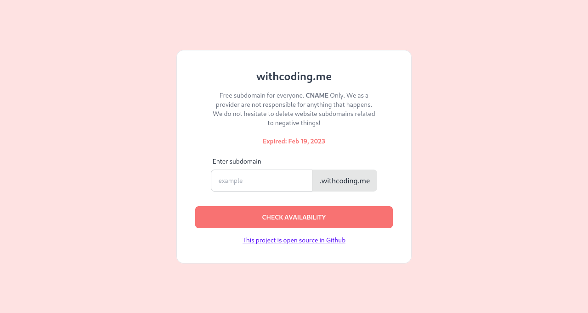

# withcoding.me

Free subdomain for everyone. **CNAME** Only. We as a provider are not responsible for anything that happens. We do not hesitate to delete website subdomains related to negative things!

This domain is valid until **Feb 19, 2023** (I don't know what to do with this domain so I made this project).

Have a question or have a problem? Just open the [issue](https://github.com/JastinXyz/withcoding.me/issues) in this repo!

# Add your free subdomain.
https://withcoding.me

# Self Hosting
- Fill all the information details in `.env`
- `npm i`
- `node .`
- enjoy.
> Note: `/add` endpoint has rate limit 250 requests per 15 minutes. You can change the duration in [index.js line 20](https://github.com/JastinXyz/withcoding.me/blob/main/index.js#L20)

# To Do
I don't know if this will be done in the near future or in the future. Feel free to contribute 😅️.

- Another records type.
- Edit system.
- Delete system.
- Proxy options.
